**The Debate about Nuclear Energy in Taiwan:**

**An Analysis on PTT**

*By Allen Yi B03302310*
  

Introduction
============

In 2015, the year before presidential election, one of the candidates, Tsai
Ing-Wen, claimed that “nuclear-free homeland has been the consensus of the
people,” and set goals to abolish nuclear energy before 2025 after being elected
in 2016. But is there really such a consensus? If there is not, then how does
the public opinion truly look like? Is there any polarization of opinion?

To answer this question, this research will look into the most popular BBS
(Bulletin Board System) in Taiwan: PTT.cc. Since this platform is open,
transparent and widely used by Taiwanese people (consistent users nearly 90
thousand per day in the past year), we can expect representative data from this
platform.

And since it is in Taiwanese context, the readers might need to have minimal
understanding on Chinese, PTT’s culture and the disputes of nuclear energy in
Taiwan.

At the ending of this research report, I provided the R code that I used to
conduct the research. Please be aware that the wording of the codes and the
wording of this report might be different.

Research Question
=================

The core research question is: how does the public opinion on nuclear energy in
Taiwan truly look like? Is there any polarization in public opinion? Do people
from different communities or positions communicate with each other?

It is also noteworthy to see if there is any “filter bubble effect,” which is a
major obstacle blocking facilitation of consensus in a democracy.

Past Research Review
====================

Before discussing how to identifying polarization, we first need to separate two
concepts: network heterogeneity and polarization. The former one refers to how
“diverse” a social network is, if most of the nodes can be linked to various
communities, then the network is heterogeneous. The latter, on the other hand,
refers to extreme spectrum of opinions in a community, often results in little
consensus among people in such community.

Intuitively thinking, with more heterogeneity in a network, there will be less
opinion polarization, because a person can consider diverse perspectives
deliberately. However, there is a possible counter argument: more exposure
actually “confirm” the original opinion, and strengthens polarization. Given
that, a heterogeneous network does not always indicates the absence of
polarization. Nonetheless, the opposite case (a homogeneous network with high
modularity) is still commonly accepted as the indicator of polarization.

In this sense, this research may infer polarization if there is a network with
high modularity, but should not infer little polarization if the opposite is the
case.

Some of methods that might help identify polarization includes but not limited
to: follower community network analysis, hyperlink network analysis,
polarization index and community boundary .

Data, Research Method and Results
=================================

Data Source
-----------

In order to gain valid insights, very specific source of data is needed. Even
though Facebook is the most dominant social media in Taiwan, its Graph API 2.0
does not provide personal information like ID of the poster or followers of a
fan page anymore[^1], which makes studying polarization nearly impossible.
Twitter is better since it has most data publicly available, but unfortunately,
Twitter is not frequently used by most Taiwanese, so it still can not provide
valid data. Hence, I decided to scrape data from PTT.cc.

[^1]: https://developers.facebook.com/blog/post/2015/04/28/april-30-migration/?ref=hp

To gain comprehensive data, I intended to get all articles available on PTT
regarding this topic. However, PTT is not a for-profit platform and cannot
afford continuously expending its servers, thus it will delete the oldest
articles and replies if the capacity of the sub-forum (看板) has been reach[^2].
It means that I can only gain access to the most recent articles.

[^2]: http://zh.pttpedia.wikia.com/wiki/%E5%88%AA%E6%96%87

Data Collection and Cleaning
----------------------------

First, I scraped google search results, since it is impractical to scrape all
PTT articles and filter all of them by myself. I used the following query
structure in a url form:

>   *"http://www.google.com.tw/search?q=", keyword, "&as_epq=", date[[i]],
>   "&as_sitesearch=www.ptt.cc&start=", 10\*j-10, "&sa=N&filter=0"*

The keyword is where I put a relevant keywords (I used three keyword in total:
擁核, 反核, 核電). “&as_epq=” means exact matching, where I match different date
of an article (such as “Jan 1”), I do this because google limits pages I can get
from one query, so that I can sort of “divide” the search results to meet the
limit. “&as_sitesearch=www.ptt.cc” means I only want articles from PTT.
“&start=” is used to signal which page to request from google. “&sa=N” is
tricky, I could not find what it means exactly, but it is always there over
different search pages. Finally we have “&filter=0,” which disables
auto-filtering set by google to drop out similar search results.

During this part of scraping, I even needed to use a R package called
“RSelenium” to monitor the process, and helped deal with captchas set by google.
But I will skip the technical details since it would not change the data I
scraped.

Because my data does not come from a well-designed API, there will be a lot of
data cleaning. From a PTT article, I built three data sets: meta data of each
article (variables include author, date, time, board (看板, it is the same as
“sub-forum”), tag, title……), main text of the article (does not include reply)
and a “push-table” (basically a data.frame with replies from an article, with
variable like ID, time, content……). This data structure consists of all what I
need in theory.

After collecting all of the data I can, I started to filter out some articles
which I believe are irrelevant. For example, I filtered out some articles from
sub-forums such as “NBA” or “Sex,” which are unlikely to have relevant articles
about the topic. Also, I filtered out announcements, North Korea’s nuclear news
and “I will not commit suicide” declarations. In addition, I used exact-word
matching by specific keywords (which is not done by google search).

I did try to use Naïve Bayes Classifier to make sure most of the articles are
relevant to the chosen topic. But I failed due to the lack of computational
capacity.

As mentioned, PTT deletes older articles. In figure 1, we can see that there is
a large gap in number of articles on each day, before a certain time period,
there are very few articles, which indicates they are being deleted[^3]. This
can be observed more clearly through figure 2.

[^3]: The reason why there is still some articles is because that PTT conservers
some particular iconic articles, and does not delete them.

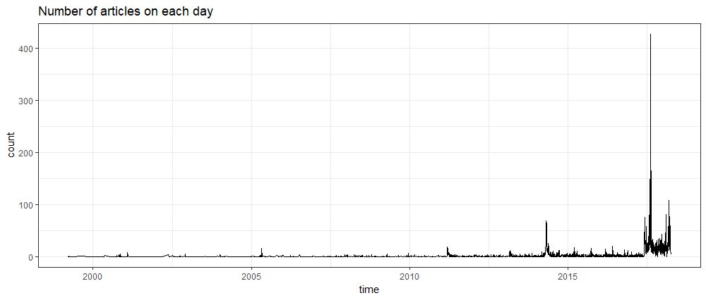

Figure 1: Number of articles on each day

In figure 2, we can see that starting from 2017/5/1, the frequency of articles
rises dramatically. Therefore, I decided to filter out all articles before this
date, and made the time span of my data starting from 2017/5/1 to 2018/4/13,
roughly 11 months.

In addition, in the same figure, you can see that the “8/15 Power Outage” is the
peak of the articles, which shows us the debate on nuclear energy issues is
highly related to the real world incident. However, the peak of “3/11
anniversary” is not so obvious, which might reflect the popularity of this event
and its parade is not as heated as before.

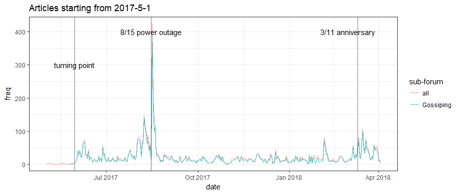

Figure 2: Articles starting from 2017-5-1

Data Exploration
----------------

Before diving in any model, let’s first look at some basic descriptive features.

In figure 3, we can see that “Gossiping sub-forum” (八卦版) is dominant among
all sub-forums. It is understandable since it is the most popular one on PTT.
What’s interesting is that articles from some of the more policy-oriented
sub-forums such as “PublicIssue” are quite few, and “politics” isn’t even in the
top 10. On the other hand, sub-forums such as “Marginalman,” “Stock” or “movie”
can be in top 10. Also, I assume “WomenTalk” can be in top 10 because some women
groups have be actively involved in nuclear energy debate.

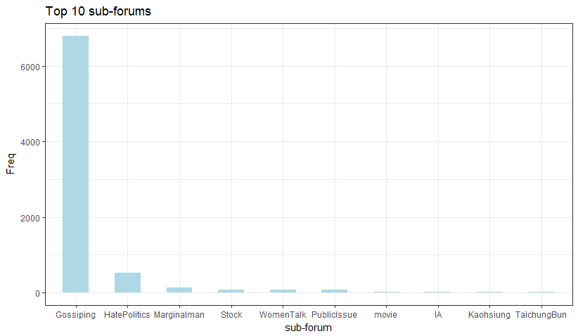

Figure 3: Top 10 sub-forums

(“IA” stands for international affairs, value is the number of the articles)

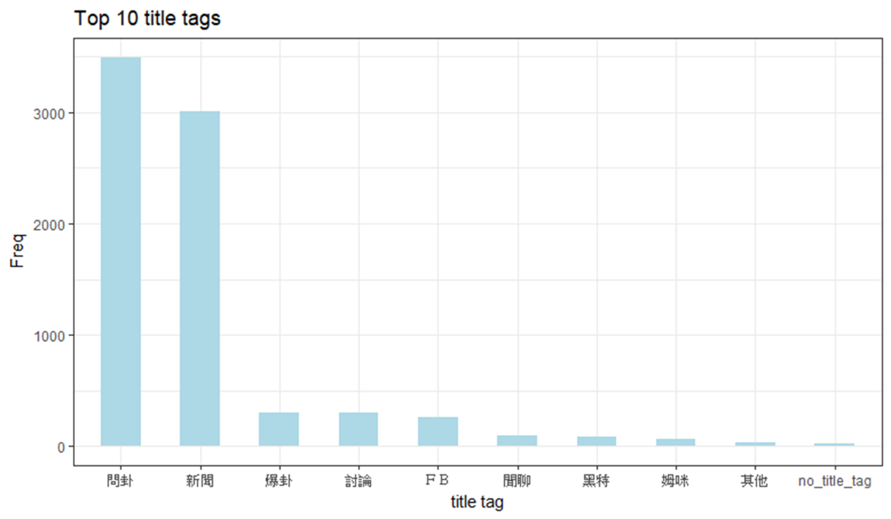

As for figure 4, we can the two most popular title tag[^4] are 問卦 (ask for
gossip) and 新聞 (news), and I am not certain what “姆咪” means.

[^4]: Title tag is what the author of an PTT article adds in the title manually
(by adding something like [title tag]), if the author decides not to add any
tag, it will be “no_title_tag” in figure 4

Figure 4: Top 10 title tag

Social Network Analysis
-----------------------

To conduct network analysis, I built a “co-occurrence network,” which makes each
user a node, and each edge means that the two users have liked (推) or disliked
(噓) the same article. For example, if an article was liked by 5 people, then
there will be 5!/2! = 10 edges among them. The assumption is that people who
like or dislike the same articles have similar positions, and so this network
can be used to identify polarization: if modularity of this network is high, we
can assume there is polarization.

This network has some basic statistics includes: number of nodes/ people:
30,363; number of edges: 5,297,404; 51 communities with modularity 0.37 (created
by Louvain algorithm); network density: 0.0115. I created 100 random graphs for
each two scenarios, and obvious significant difference can be confirmed, as
shown in table 1.

Moreover, the sizes of each community in this co-occurrence network differ
largely: the largest 12 communities contain 97.4% of total nodes (with
modularity 0.36). Hence, I decided to only observe these 12 communities and
ignore the ones which are rather small. And in table 2, we can also see that the
biggest communities consists of 43.73% of nodes, which is nearly half.

|   | Erdos Renyi game[^5] |
|---|----------------------|

[^5]: Creating random networks with the same number of nodes and edges.

    Degree sequence game[^6]

    [^6]: Creating random networks with the same degree sequence.

| average modularity                        | 0.0469 | 0.03395 |   |   |
|-------------------------------------------|--------|---------|---|---|
| standard deviation of modularity          | 0.0007 | 0.00048 |   |   |
| average number of community               | 7.04   | 9.44    |   |   |
| standard deviation of number of community | 1.0142 | 0.87985 |   |   |

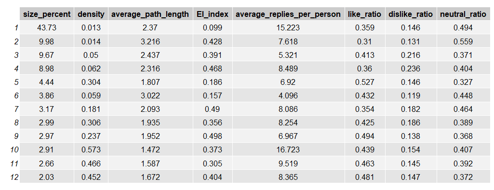

Table 1: Results of 100 random networks

Table 2: Features of the communities

(For this report, communities are numbered by the rank of their sizes, starting
from 1)

Looking deeper in table 2, we can see that the bigger the density is, the
smaller the average path length is (correlation is -0.87), which is consistent
to the intuition[^7]. For some unknown reasons, community 1 and 10 have
significantly higher average replies per person[^8]. And most importantly, EI
indices are all positive, with most of them being bigger than 0.3, indicating
these communities are mostly outward-oriented. This is a strong sign of
interaction among communities.

[^7]: Bigger density indicates more edges, and it’s easier for each node to
“walk to” another node.

[^8]: To accurately quantify how active a user is, the number of replies are
actually calculated by how many “lines” of replies each person has.

Observing the active dates and time of each communities through figure 5 and 6,
I could not find any obvious sign that can help me characterize any of the
community because the active date and time are roughly consistent among
communities. Of course, there are some small peaks (dark green line in figure
5), but it’s too dangerous to make any interpretation on such minor difference.

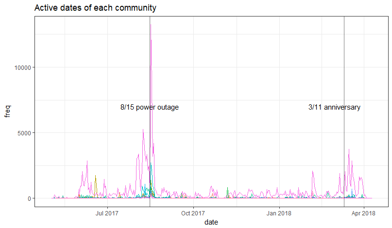

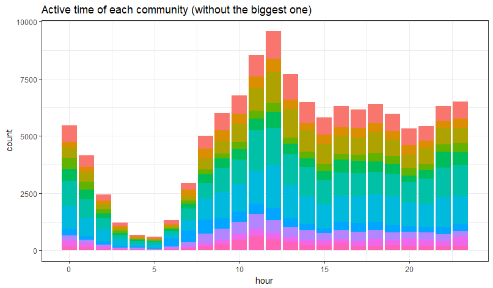

Figure 5: Active dates of each community

Figure 6: Active time of each community (without the biggest one)[^9]

[^9]: In order to visualize the distribution clearly, I took out the biggest
community.

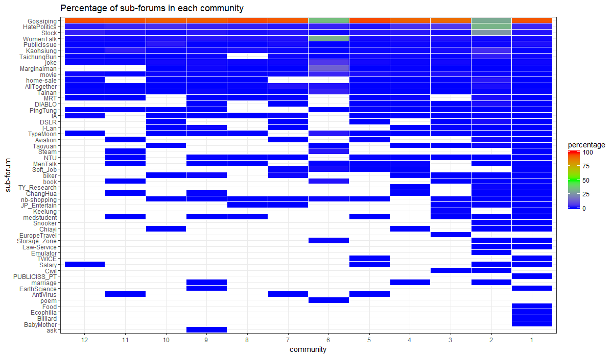

In figure 7, we see that “Gossiping sub-forum” is dominant in each community,
except for community 2 and 6. For community 2, I assume this is because some
woman environmental groups are active there, but I have no further evidence.

Figure 7: Percentage of sub-forums in each community

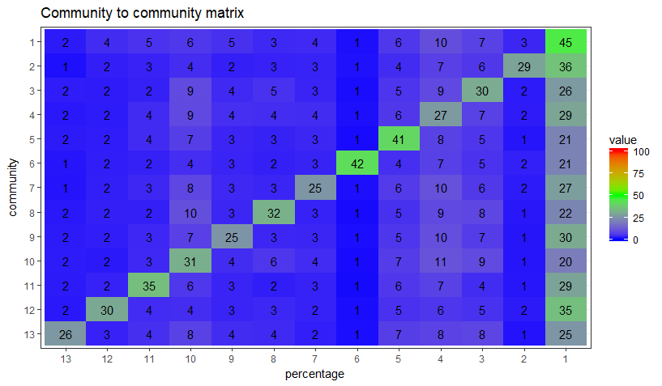

Figure 8: Community to community matrix

In figure 8, values in each row represent percentage of a community’s edges
linking to another (each row’s sum is 100%), and community 13 is the combination
of the rest of the communities. On the antidiagonal, we see all of the values
are less than 50%, which tells the same story as the EI-index: these communities
are outward-oriented. Furthermore, community 2 and 6 receive less connections in
general.

Topic Modeling
--------------

After establishing the communities, I used “jiebaR” package to conduct Chinese
word segmentation and did some text mining. I tried word cloud and TF-IDF (term
frequency–inverse document frequency)[^10], both of them didn’t work very well.
The former one only tell me that each community has similar most frequent words,
and the latter one didn’t really give any recognizable features.

[^10]: This type of analysis focuses on extracting key words in each document
(in this case, the replies in each community) that is frequent within the
particular document, but less frequent across the documents.

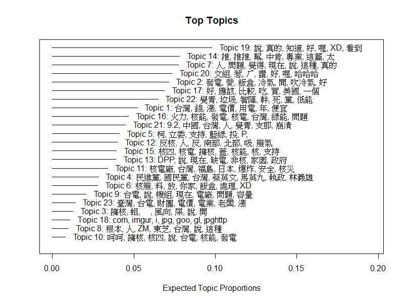

After this, I combined each user’s replies into one document, and used these
documents to fit topic models in “stm” package. I tried different numbers of
topics from 10 to 30, and subjectively picked 23 topics because I believe this
one has the most intuitive topic clusters. The result is in figure 9.

Figure 9: Topics summary with expected topic proportion

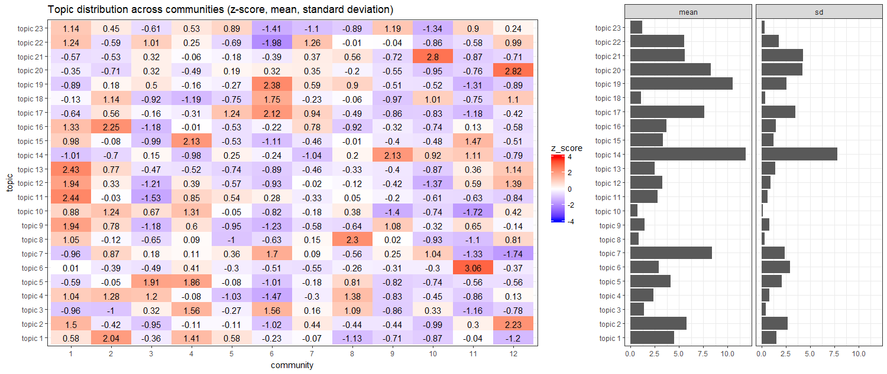

Figure 10: Topic distribution across communities

If we aggregate the topic distribution of each individual in a community and do
comparison across communities, we can produce figure 10. The graph on the right
side shows the means of topic proportion of each community, and also the
standard deviations of the means of topic proportion of each community. The
graph on the left shows the z-score of the topic proportion of each community.
For example, in community 1, the proportion of topic 8 is bigger than other
communities by 1.05 standard deviation.

By observing the comparison, we see some communities focus on particular topics.
But please be aware that these z-scores can only be compared across communities
within the same topic, and comparison across topics in the same community is
meaningless since they share different means and standard deviations. In
addition, having the same z-scores doesn’t imply the same level of variation
since the standard deviations might be different.

Without further information (such as demographic features of each community),
this graph is extremely difficult to interpret. Using certain words more often
than others can’t prove they have specific stances because meaning of the words
must be put under context. For the same reason, polarization of opinion can’t be
confirmed.

However, if we observe what’s “inside” of each community, we can see
heterogeneity within each community. In figure 11, each topic has its own
boxplot visualizing the variation the topic proportion across users in each
community. We can see the gap between Q1 and Q3, and quite a lot of outlier. I
believe this indicates the homophily effect in each community is limited.

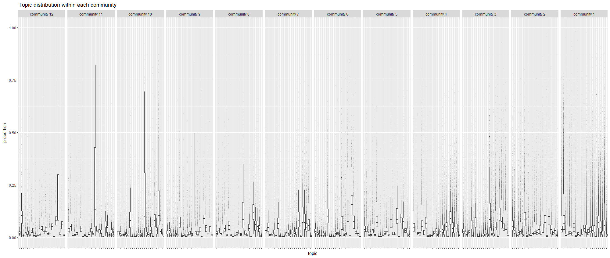

Figure 11: Topic distribution within each community

Discussion
==========

Is there Polarization, or Not?
------------------------------

Simply put, there is no sufficient evidence that proves the existence of
polarization, but it doesn’t mean that it doesn’t exist, either.

First, the modularity of this network is 0.37, not particularly high.

Second, looking into EI index and community to community matrix, we can confirm
interactions and similar positions among communities to a certain degree
(recalling the assumption that like/ dislike the same article represents similar
positions).

Third, if we look into the topic distribution within each community, we see
heterogeneity among users in the same community. I believe this is an indirect
evidence because if people are talking about different topics in the same
community, the likelihood of polarization won’t be very high.

Limitation
----------

First of all, PTT can not represent the public opinion of the entire Taiwan, and
there could be spiral of silence which polarize the debate discourse, or some
intentional manipulation of public opinion. Not to mention a lot of people don’t
even use PTT.

Second, PTT allow people to express through images and video embedment, which
are difficult analyze.

Third, older articles could be deleted, and results in biased data samples
(there were some 404 notfound in those urls).

Forth, the positions of text content are very hard to identify, especially with
more taunting style of discussion and unique Internet wording on PTT.
Furthermore, like/ dislike the same article doesn’t necessarily represent the
similar stances.

Fifth, filtering process may be biased. For instance, some articles containing
the key words might be just mentioning rather than truly discussing nuclear
energy.

Sixth, a lot of the interpretations in this research report are subjective, and
thus questionable.

Outlook
-------

Originally, this research aims to discover insights on the public opinion of
nuclear energy in Taiwan. However, even with some interesting results, it’s
still very difficult to make any concrete conclusion with the lack of crucial
evidence. In this case, I believe this research is more about digging out the
potential of PTT.cc network analysis, given the accessible data.

More can be done, of course. For example, a network consisting of all types of
interactions (not only mutual like/ dislike), or some more sophisticated text
mining, might provide from information.

In the end, I think the biggest downside of this research is the lack of user
information. If this is available, we can characterize communities much easier.

Appendix: R Code

### 0. Background setting

~~~~~~~~~~~~~~~~~~~~~~~~~~~~~~~~~~~~~~~~~~~~~~~~~~~~~~~~~~~~~~~~~~~~~~~~~~~~~~~~
#basic data processing
library(dplyr)
library(data.table)
#scrapping
library(rvest)
library(RSelenium)
library(httr)
#supporting package for scrapping Google
library(beepr)
library(lubridate)
#string manipulation
library(stringr)
library(rex)
#text mining
library(jiebaR)
library(text2vec) #to create DTM
library(tidytext)
library(stm) #for topic modeling
#machine learning (naive bayes classifier)
library(e1071) 
library(Matrix)
#speed things up
library(parallel)
#visualization
library(ggplot2)
library(gridExtra)
#network analysis
library(igraph)
library(isnar)  #E-I index

options(stringsAsFactors = F)

if (installr::is.windows()) {
    Sys.setlocale("LC_ALL", 'C') # 'C' stands for C language
}

#set it back if you need to read chinese
Sys.setlocale("LC_ALL", "Chinese (Traditional)_Taiwan.950")
~~~~~~~~~~~~~~~~~~~~~~~~~~~~~~~~~~~~~~~~~~~~~~~~~~~~~~~~~~~~~~~~~~~~~~~~~~~~~~~~

~~~~~~~~~~~~~~~~~~~~~~~~~~~~~~~~~~~~~~~~~~~~~~~~~~~~~~~~~~~~~~~~~~~~~~~~~~~~~~~~
#keep track of the environment (versions)
sessionInfo()
~~~~~~~~~~~~~~~~~~~~~~~~~~~~~~~~~~~~~~~~~~~~~~~~~~~~~~~~~~~~~~~~~~~~~~~~~~~~~~~~

~~~~~~~~~~~~~~~~~~~~~~~~~~~~~~~~~~~~~~~~~~~~~~~~~~~~~~~~~~~~~~~~~~~~~~~~~~~~~~~~
## R version 3.4.4 (2018-03-15)
## Platform: x86_64-w64-mingw32/x64 (64-bit)
## Running under: Windows 10 x64 (build 17134)
## 
## Matrix products: default
## 
## locale:
## [1] LC_COLLATE=Chinese (Traditional)_Taiwan.950 
## [2] LC_CTYPE=Chinese (Traditional)_Taiwan.950   
## [3] LC_MONETARY=Chinese (Traditional)_Taiwan.950
## [4] LC_NUMERIC=C                                
## [5] LC_TIME=Chinese (Traditional)_Taiwan.950    
## 
## attached base packages:
## [1] parallel  stats     graphics  grDevices utils     datasets  methods  
## [8] base     
## 
## other attached packages:
##  [1] isnar_1.0-0         igraph_1.2.1        gridExtra_2.3      
##  [4] ggplot2_2.2.1       Matrix_1.2-12       e1071_1.6-8        
##  [7] stm_1.3.3           tidytext_0.1.9      text2vec_0.5.1     
## [10] jiebaR_0.9.99       jiebaRD_0.1         rex_1.1.2          
## [13] stringr_1.3.1       lubridate_1.7.4     beepr_1.3          
## [16] httr_1.3.1          RSelenium_1.7.1     rvest_0.3.2        
## [19] xml2_1.2.0          data.table_1.10.4-3 dplyr_0.7.4        
## 
## loaded via a namespace (and not attached):
##  [1] Rcpp_0.12.17         lattice_0.20-35      installr_0.20.0     
##  [4] tidyr_0.8.1          binman_0.1.0         class_7.3-14        
##  [7] assertthat_0.2.0     rprojroot_1.3-2      digest_0.6.15       
## [10] psych_1.8.4          foreach_1.4.4        R6_2.2.2            
## [13] plyr_1.8.4           futile.options_1.0.1 backports_1.1.2     
## [16] evaluate_0.10.1      pillar_1.2.3         rlang_0.2.1         
## [19] lazyeval_0.2.1       rmarkdown_1.10       wdman_0.2.2         
## [22] foreign_0.8-69       munsell_0.5.0        broom_0.4.4         
## [25] compiler_3.4.4       janeaustenr_0.1.5    pkgconfig_2.0.1     
## [28] mnormt_1.5-5         htmltools_0.3.6      openssl_1.0.1       
## [31] tibble_1.4.2         codetools_0.2-15     audio_0.1-5         
## [34] XML_3.98-1.11        bitops_1.0-6         SnowballC_0.5.1     
## [37] grid_3.4.4           gtable_0.2.0         nlme_3.1-131.1      
## [40] magrittr_1.5         formatR_1.5          semver_0.2.0        
## [43] scales_0.5.0         tokenizers_0.2.1     RcppParallel_4.4.0  
## [46] stringi_1.1.7        reshape2_1.4.3       bindrcpp_0.2.2      
## [49] futile.logger_1.4.3  lambda.r_1.2.3       iterators_1.0.9     
## [52] tools_3.4.4          glue_1.2.0           mlapi_0.1.0         
## [55] purrr_0.2.5          yaml_2.1.19          colorspace_1.3-2    
## [58] caTools_1.17.1       knitr_1.20           bindr_0.1.1
~~~~~~~~~~~~~~~~~~~~~~~~~~~~~~~~~~~~~~~~~~~~~~~~~~~~~~~~~~~~~~~~~~~~~~~~~~~~~~~~

### 1. Scraping websites

#### 1.1 Getting URLs of the targetted websites from google search

##### 1.1.1 Using RSelenium to scrape google search results

~~~~~~~~~~~~~~~~~~~~~~~~~~~~~~~~~~~~~~~~~~~~~~~~~~~~~~~~~~~~~~~~~~~~~~~~~~~~~~~~
if (installr::is.windows()) {Sys.setlocale("LC_ALL", 'C') }  
#First change into English and then create date (every possible date in a year), and then take all space, replace with +
date <- as.Date(42368:42733, origin = "1900-01-01")%>%format(format = "%b+%e")%>%str_replace_all(" ", "")   
head(date)   #check if english

rD <- rsDriver(port = 4444L)        #set up server
remDr <- rD[["client"]]  #set up remoteDriver

remDr$open()  #if no window opened

#It is the function scraping urls from google search, using Rselenium
#Need to make sure the directory in "file" exists
seleniumsearch <- function(keyword = keyword, save = NULL, 
                           file = "data/url_list_full/url_list", 
                           dates = 1:length(date) ){
readkey <- function(){
    cat ("Press [enter] to continue")
    line <- readline()
}   #the function to stop the loop and let you handle captcha

for (i in dates) {  #filter with different date
         j <- 1   #selecting different pages of a google search result
repeat{
    Sys.setlocale("LC_ALL", "Chinese (Traditional)_Taiwan.950")
    
    url2 <- paste0("http://www.google.com.tw/search?q=", keyword, "&as_epq=",   date[[i]], "&as_sitesearch=www.ptt.cc&start=", 10*j-10,"&sa=N&filter=0")
    
    remDr$navigate(url2) #open the search page
    
    k <- 0
    
    tryCatch(
    doc2 <- read_html(remDr$getPageSource()[[1]]),
    error = function(e){ beep(8, beep(7)) ; print(e); readkey()
        doc2 <- read_html(remDr$getPageSource()[[1]])
        k <- 1
        }  
        ) #if error, stop the loop for captcha or other unexpected things
    
    Sys.setlocale("LC_ALL", "Chinese (Traditional)_Taiwan.950")
    check_captcha <- html_text(doc2)
    if(grepl("我們的系統偵測到您的電腦網路送出的流量有異常情況",  check_captcha) & k!=1) { 
            beep(8, beep(7))
            readkey()
            doc2 <- read_html(remDr$getPageSource()[[1]])
        }  #check if there is a captcha, and stop the loop to handle manually
    
    xpath2 <- '///h3/a' #where the urls are
    node2 <- html_nodes(doc2, xpath = xpath2)
    
    if (length(node2)==0) {Sys.sleep(runif(1, min = 6, max = 9)) ; break}  
    #stop the loop if no more results available
        
    url_list <- html_attr(node2, name = "href")
        
    Sys.setlocale("LC_ALL", "Chinese (Traditional)_Taiwan.950")
    if (save){ #save the urls 
        saveRDS(url_list, 
                file = paste0(file, "/url_list", keyword, "_date", i, "_page", j, ".rds")) }
    
    print(paste(j, head(url_list, n = 1))) #show progress
        
    j <- j+1
    Sys.sleep(runif(1, min = 6, max = 9))
    }
    print(date[[i]])  #show progress
    }
}

#start scraping (example)
seleniumsearch(keyword = "核電", save = T, file = "data/url_list_full/keyword3", dates = 300:366)

rD[["server"]]$stop()  #end the server in the end
~~~~~~~~~~~~~~~~~~~~~~~~~~~~~~~~~~~~~~~~~~~~~~~~~~~~~~~~~~~~~~~~~~~~~~~~~~~~~~~~

##### 1.1.2 Merging multiple urls and filter (keyword1)

~~~~~~~~~~~~~~~~~~~~~~~~~~~~~~~~~~~~~~~~~~~~~~~~~~~~~~~~~~~~~~~~~~~~~~~~~~~~~~~~
Sys.setlocale("LC_ALL", "Chinese (Traditional)_Taiwan.950")

#create a full url list all from keyword1
keyword1_url_list <- character()  
for (i in 1:length(list.files("C:/Users/User/Documents/R/social network analysis research project-PTT/data/url_list_full/keyword1"))) {
    
  temp1 <- readRDS(file = paste0("C:/Users/User/Documents/R/social network analysis research project-PTT/data/url_list_full/keyword1/", list.files("C:/Users/User/Documents/R/social network analysis research project-PTT/data/url_list_full/keyword1")[[i]]))
  keyword1_url_list <- c(keyword1_url_list, temp1)
}

#take out non-ptt-article urls
truepttpost1 <- grepl(pattern = "https://www.ptt.cc", x = keyword1_url_list)
truepttpost.count1 <- sum(truepttpost1) #numer of true ptt post
print(truepttpost.count1)
length(keyword1_url_list)-truepttpost.count1  #numer of "not" ptt post

keyword1_url_list <- keyword1_url_list[truepttpost1]
keyword1_url_list <- unique(keyword1_url_list) #getting the actual ptt url list

board1 <- sapply(strsplit(keyword1_url_list, split = "/"), 
                FUN = function(x) unlist(x)[[5]])

#the distribution of different boards of the posts
arrange(as.data.frame(table(board1)), Freq)[, 2]%>%pie(labels = arrange(as.data.frame(table(board1)), Freq)[, 1]) 

#take away urls in particular boards
exclude_board1 <-c("IA", "C_Chat", "sex", "BB-Love", "DummyHistory", "Military", "CrossStrait", "Chinese", "WOW", "GL", "gay", "marvel",  "HwangYih", "creditcard", "Warfare", "lesbian", "PC_Shopping", "L_TalkandCha", "emprisenovel", "TaiwanDrama", "Magic", "GUNDAM", "car", "NBA", "historia", "specialman", "KoreaDrama", "Paradox", "MayDay", "Japan_Travel", "Golden-Award", "gallantry", "feminine_sex", "CFantasy", "the_L_word", "Tech_Job", "Road", "PlayStation", "Physics", "LightNovel", "H-GAME", "GirlsFront", "Violation", "Teacher", "sttmountain", "SMSlife", "Ocean", "Japandrama", "Finance", "Evangelion", "TigerBlue", "TC92-616", "Suckcomic", "SSSH-16th-Fk", "RockMetal", "Railway", "PublicServan", "NTU-dolphin", "NCU91ME", "WuLing40-311", "MobileComm", "Militarylife", "LAW", "KingdomHuang", "KanColle", "ForeignEX", "Confucianism", "China-Drama", "C_ChatBM", "Baseball", "Detective", "Record")

toofew_board1 <- as.data.frame(table(board1), stringsAsFactors = F)[as.data.frame(table(board1))[, 2]<=3, 1]

selector1 <- paste(unique(c(exclude_board1, toofew_board1)), collapse = "|")

keyword1_url_list <- keyword1_url_list[!grepl(pattern = selector1, x = board1)]

#pie graph of board distribution
sapply(strsplit(keyword1_url_list, split = "/"), FUN = function(x) unlist(x)[5])%>%table()%>%sort()%>%pie(labels = c( rep("", time = 24), "WomenTalk", "HatePolitics", "PublicIssue","Gossiping"))

#ranking of board distribution
sapply(strsplit(keyword1_url_list, split = "/"), FUN = function(x) unlist(x)[5])%>%table()%>%sort()%>%names()
~~~~~~~~~~~~~~~~~~~~~~~~~~~~~~~~~~~~~~~~~~~~~~~~~~~~~~~~~~~~~~~~~~~~~~~~~~~~~~~~

##### 1.1.3 Merging multiple urls and filter (keyword2)

~~~~~~~~~~~~~~~~~~~~~~~~~~~~~~~~~~~~~~~~~~~~~~~~~~~~~~~~~~~~~~~~~~~~~~~~~~~~~~~~
Sys.setlocale("LC_ALL", "Chinese (Traditional)_Taiwan.950")

#create a full url list all from keyword2
keyword2_url_list <- character()  
for (i in 1:length(list.files("C:/Users/User/Documents/R/social network analysis research project-PTT/data/url_list_full/keyword2"))) {
    
  temp2 <- readRDS(file = paste0("C:/Users/User/Documents/R/social network analysis research project-PTT/data/url_list_full/keyword2/", list.files("C:/Users/User/Documents/R/social network analysis research project-PTT/data/url_list_full/keyword2")[[i]]))
  keyword2_url_list <- c(keyword2_url_list, temp2)
}

#take out non-ptt-article urls
truepttpost2 <- grepl(pattern = "https://www.ptt.cc", x = keyword2_url_list)
sum(truepttpost2) #numer of true ptt post
length(keyword2_url_list)-sum(truepttpost2)  #numer of "not" ptt post

keyword2_url_list <- keyword2_url_list[truepttpost2]
keyword2_url_list <- unique(keyword2_url_list) #getting the actual ptt url list
length(keyword2_url_list)

board2 <- sapply(strsplit(keyword2_url_list, split = "/"), 
                FUN = function(x) unlist(x)[[5]])

#the distribution of different boards of the posts
arrange(as.data.frame(table(board2)), Freq)[, 2]%>%pie(labels = arrange(as.data.frame(table(board2)), Freq)[, 1]) 

#take away urls in particular boards
exclude_board2 <-c("C_Chat", "sex", "BB-Love", "DummyHistory", "Military", "CrossStrait", "Chinese", "WOW", "GL", "gay", "marvel",  "HwangYih", "creditcard", "Warfare", "lesbian", "PC_Shopping", "L_TalkandCha", "emprisenovel", "TaiwanDrama", "Magic", "GUNDAM", "car", "NBA", "historia", "specialman", "KoreaDrama", "Paradox", "MayDay", "Japan_Travel", "Golden-Award", "gallantry", "feminine_sex", "CFantasy", "the_L_word", "Tech_Job", "Road", "PlayStation", "Physics", "LightNovel", "H-GAME", "GirlsFront", "Violation", "Teacher", "sttmountain", "SMSlife", "Ocean", "Japandrama", "Finance", "Evangelion", "TigerBlue", "TC92-616", "Suckcomic", "SSSH-16th-Fk", "RockMetal", "Railway", "PublicServan", "NTU-dolphin", "NCU91ME", "WuLing40-311", "MobileComm", "Militarylife", "LAW", "KingdomHuang", "KanColle", "ForeignEX", "Confucianism", "China-Drama", "C_ChatBM", "Baseball", "Detective", "Record", "Gov_owned", "LoL", "Music-Sell", "Hearthstone", "stationery", "Examination", "StupidClown", "Hiking", "Simcity", "SENIORHIGH", "WarCraft", "prozac", "toberich", "Option", "CVS", "NTUcourse", "graduate", "ID_Multi", "Lineage", "MLB", "NextTV", "GossipPicket", "bicycle", "transgender", "ONE_PIECE", "NTU-Exam", "HateP_Picket", "SuperHeroes", "SF", "postcrossing0", "photo", "hypermall", "EAseries", "DiscuService", "Coffee", "Aves")

toofew_board2 <- as.data.frame(table(board2), stringsAsFactors = F)[as.data.frame(table(board2))[, 2]<=3, 1]

selector2 <- paste(unique(c(exclude_board2, toofew_board2)), collapse = "|")

keyword2_url_list <- keyword2_url_list[!grepl(pattern = selector2, x = board2)]

#take away overlapping urls from keyword2_url_list
keyword2_url_list <- anti_join(data.frame(url = keyword2_url_list), data.frame(url = keyword1_url_list))%>%unlist()
length(keyword2_url_list)

#pie graph of board distribution
sapply(strsplit(keyword2_url_list, split = "/"), 
       FUN = function(x) unlist(x)[5])%>%table()%>%sort()%>%pie()

#ranking of board distribution
sapply(strsplit(keyword2_url_list, split = "/"), FUN = function(x) unlist(x)[5])%>%table()%>%sort()%>%names()
~~~~~~~~~~~~~~~~~~~~~~~~~~~~~~~~~~~~~~~~~~~~~~~~~~~~~~~~~~~~~~~~~~~~~~~~~~~~~~~~

##### 1.1.4 Merging multiple urls and filter (keyword3)

~~~~~~~~~~~~~~~~~~~~~~~~~~~~~~~~~~~~~~~~~~~~~~~~~~~~~~~~~~~~~~~~~~~~~~~~~~~~~~~~
Sys.setlocale("LC_ALL", "Chinese (Traditional)_Taiwan.950")

#create a full url list all from keyword3
keyword3_url_list <- character()  
for (i in 620:length(list.files("C:/Users/User/Documents/R/social network analysis research project-PTT/data/url_list_full/keyword3"))) {
    temp3 <- readRDS(file = paste0("C:/Users/User/Documents/R/social network analysis research project-PTT/data/url_list_full/keyword3/", list.files("C:/Users/User/Documents/R/social network analysis research project-PTT/data/url_list_full/keyword3")[[i]]))
    keyword3_url_list <- combine(keyword3_url_list, temp3)
    cat(i, "/")
}

#list.files("C:/Users/User/Documents/R/social network analysis research project-PTT/data/url_list_full/keyword3")[[614]], Error: unknown input format, ???   all of them: 614-619(don't know how many)  

#take out non-ptt-article urls
truepttpost3 <- grepl(pattern = "https://www.ptt.cc", x = keyword3_url_list)
sum(truepttpost3) #numer of true ptt post
length(keyword3_url_list)-sum(truepttpost3)  #numer of "not" ptt post

keyword3_url_list <- keyword3_url_list[truepttpost3]
keyword3_url_list <- unique(keyword3_url_list) #getting the actual ptt url list
length(keyword3_url_list)

board3 <- sapply(strsplit(keyword3_url_list, split = "/"), 
                FUN = function(x) unlist(x)[[5]])

#the distribution of different boards of the posts
arrange(as.data.frame(table(board3)), Freq)[, 2]%>%pie(labels = arrange(as.data.frame(table(board3)), Freq)[, 1]) 

#take away urls in particular boards
exclude_board3 <-c("C_Chat", "sex", "BB-Love", "DummyHistory", "Military", "CrossStrait", "Chinese", "WOW", "GL", "gay", "marvel",  "HwangYih", "creditcard", "Warfare", "lesbian", "PC_Shopping", "L_TalkandCha", "emprisenovel", "TaiwanDrama", "Magic", "GUNDAM", "car", "NBA", "historia", "specialman", "KoreaDrama", "Paradox", "MayDay", "Japan_Travel", "Golden-Award", "gallantry", "feminine_sex", "CFantasy", "the_L_word", "Tech_Job", "Road", "PlayStation", "Physics", "LightNovel", "H-GAME", "GirlsFront", "Violation", "Teacher", "sttmountain", "SMSlife", "Ocean", "Japandrama", "Finance", "Evangelion", "TigerBlue", "TC92-616", "Suckcomic", "SSSH-16th-Fk", "RockMetal", "Railway", "PublicServan", "NTU-dolphin", "NCU91ME", "WuLing40-311", "MobileComm", "Militarylife", "LAW", "KingdomHuang", "KanColle", "ForeignEX", "Confucianism", "China-Drama", "C_ChatBM", "Baseball", "Detective", "Record", "AKB48", "hardware", "VideoCard", "Soft_Job", "Snooker", "Steam", "True-Escape", "RTS", "Minecraft", "Hunter", "Old-Games", "Little-Games", "OverWatch", "CGI-Game", "Key_Mou_Pad", "Tai-travel", "NewAge", "Mechanical", "DNF", "SET", "soul", "TWICE", "Emulator", "Buddhism", "BigBanciao", "YAseries", "travel", "travel", "Headphone", "AboutBoards", "NTHU_Course")

toofew_board3 <- as.data.frame(table(board3), stringsAsFactors = F)[as.data.frame(table(board3))[, 2]<=3, 1]

selector3 <- paste(unique(c(exclude_board3, toofew_board3, exclude_board2)), collapse = "|")

keyword3_url_list <- keyword3_url_list[!grepl(pattern = selector3, x = board3)]

#take away overlapping urls from keyword2_url_list
keyword3_url_list <- anti_join(data.frame(url = keyword3_url_list), data.frame(url = keyword2_url_list))%>%anti_join(data.frame(url = keyword1_url_list))%>%unlist()

names(keyword3_url_list) <- NULL

length(keyword3_url_list)

#keyword3_url_list corrupted for unknown reason
keyword3_url_list.left <- keyword3_url_list.new[!duplicated(c(keyword3_url_list.old[1:4792], keyword3_url_list.new))[4793:10981]]

names(keyword3_url_list.left) <- NULL

#pie graph of board distribution
sapply(strsplit(keyword3_url_list, split = "/"), FUN = function(x) unlist(x)[5])%>%table()%>%sort()%>%pie()

#ranking of board distribution
sapply(strsplit(keyword3_url_list, split = "/"), FUN = function(x) unlist(x)[5])%>%table()%>%sort()%>%names()
~~~~~~~~~~~~~~~~~~~~~~~~~~~~~~~~~~~~~~~~~~~~~~~~~~~~~~~~~~~~~~~~~~~~~~~~~~~~~~~~

#### 1.2 Scraping PTT.cc

##### 1.2.1 Scraping a specific PTT.cc website and clean it

~~~~~~~~~~~~~~~~~~~~~~~~~~~~~~~~~~~~~~~~~~~~~~~~~~~~~~~~~~~~~~~~~~~~~~~~~~~~~~~~
#the function to scrape PTT with a given url list
scrape_ptt <- function (url_list = url_list, start = 1, 
                        end = length(url_list), file = file){
i <- start

repeat {
result <- tryCatch({ #change error behavier
    Sys.setlocale("LC_ALL", "Chinese (Traditional)_Taiwan.950")
    
    url <- url_list[i]
    res <- GET(url, config = set_cookies("over18" = "1"))
    res.string <- content(res, "text", encoding = "utf-8")
    doc   <- read_html(res.string)
    
    if(grepl(html_text(doc), pattern = "404 - Not Found")){
        cat("404 - Not Found")
        i <- i+1
        next}
        
    css <- "#main-content"
    node.a <- html_nodes(doc, css)
    
    #getting the meta data of an article
    main_text_meta <- html_nodes(doc, "#main-content > div.article-metaline> span.article-meta-value")%>%html_text()
    
    title <- main_text_meta[[2]]
    
    text_meta <- data.frame(
        "url" = url_list[i],
        "bbs_or_man" = sapply(strsplit(url_list[i], split = "/"), 
                              FUN = function(x) unlist(x)[[4]]),
        "article_type" = if (grepl(pattern = "Fw:",x = title)) 
            {"Fw"} else if (grepl(pattern = "Re:",x = title))
            {"Re"} else {"normal"},
        "title" = title, 
        "title_tag" = if (grepl(pattern = "\\[|\\]",x = title))
            {paste(str_split(title, "\\[|\\]")[[1]][2:(length(str_split(title, "\\[|\\]")%>%unlist())-1)],  collapse = "")
            } else {"no_title_tag"},
        "author" = main_text_meta[[1]], 
        "board" = unlist(strsplit(url_list[[i]], split = "/"))[[5]],  
        "datetime" =  main_text_meta[[3]],
        stringsAsFactors = F, row.names = NULL
        ) #the name of the board might not be original(被放到精華區之類的)
    
    Sys.setlocale("LC_ALL", 'C') #to produce correct format for as.POSIXct()
    #change the format of datetime
    text_meta$datetime <- substr(text_meta$datetime, 5, 24)%>%as.POSIXct(format = "%b %e %H:%M:%S %Y", tz = "Etc/GMT+8")
    
    Sys.setlocale("LC_ALL", "Chinese (Traditional)_Taiwan.950")
    
    #getting all the text of the article
    all_text <- strsplit(html_text(node.a), split = "\n")[[1]]
    
    #exact matching by a comprehensive list of keywords 
    if(grepl("核能|核電|反核|廢核|非核|擁核|核一|核二|核三|核四|核終|飯盒", all_text)%>%sum()==0) {
        i <- i+1
        cat("exclude from exact match")
        next}
    
    #get the main_text excluding replies
    main_text <- anti_join(data.frame(text = all_text), data.frame(text = html_nodes(doc, css = "#main-content > div.push")%>%html_text()%>%substr(1, nchar(html_nodes(doc, css = "#main-content > div.push")%>%html_text())-1)), by = "text")
    main_text <- data.frame(main_text = main_text[, ])
    names(main_text) <- url_list[i]
    
    #getting the replies of the article (if any)
    if (length(html_nodes(doc, css = 'div.push > span.hl.push-tag'))!=0) {
    push_table <- data.frame(
        url = url_list[i],
        tag = html_nodes(doc, css = 'div.push > span.hl.push-tag')%>%html_text(),
        id = html_nodes(doc, css = 'div.push > span.hl.push-userid')%>%html_text(),
        content = html_nodes(doc, css = 'div.push > span.f3.push-content')%>%html_text()%>%substr(3, nchar(html_nodes(doc, css = 'div.push > span.f3.push-content')%>%html_text())),
        datetime = html_nodes(doc, css = 'div.push > span.push-ipdatetime')%>%html_text()%>%substr(2, 12)
    )
    
    #change the format of datetime
    push_table$datetime <- paste(substr(main_text_meta[[3]], 21, 24), push_table$datetime)%>%as.POSIXct(format = "%Y %m/%d  %H:%M", tz = "Etc/GMT+8")
    #if Dec -> Jan, +1 year, because datetime in push_table doesn't show year
    if (grepl("01", substr(push_table[, 5], 1, 2))%>%sum() > 0 & grepl("12", substr(push_table[, 5], 1, 2))%>%sum() > 0) { 
        k <- 0
        for (i in 1:nrow(push_table)) {
            push_table[i, 5] <- list(push_table[i, 5] + years(k))
            if (identical(substr(push_table[i, 5], 1, 2), "12") & identical(substr(push_table[i+1, 5], 1, 2), "01") ) {k <- k+1}
    } } 
    } #finishing push_table
   
    #saving three data sets
    saveRDS(text_meta, paste0(file, "/text_meta/text_meta", i, ".rds") )
    
    saveRDS(main_text, paste0(file, "/main_text/main_text", i, ".rds"))
    #save push_table only when there is reply
    if (length(html_nodes(doc, css = 'div.push > span.hl.push-tag'))!=0) {
        saveRDS(push_table, paste0(file, "/push_table/push_table", i, ".rds"))
    } 
    
    cat(i, "/")
    
    if(i >= end) { 
        print("--the end of scraping--")
        break}
    
    i <- i+1
    
    Sys.sleep(runif(1, min = 5, max = 7))
}, error = identity) 
    if (is(result, "error")) {
        saveRDS(i, file = paste0(file, "/error_record/", i, ".rds"))
        cat(i, "error"); i <- i+1
        cat(as.character(result))
        next} #the end of trycatch 
        
} #the end of repeat()
} #the end of function

#start scraping (example)
scrape_ptt(url_list = error_url_list, start = 1, file = "data/text_list/error")
~~~~~~~~~~~~~~~~~~~~~~~~~~~~~~~~~~~~~~~~~~~~~~~~~~~~~~~~~~~~~~~~~~~~~~~~~~~~~~~~

##### 1.2.2 Dealing urls with errors

~~~~~~~~~~~~~~~~~~~~~~~~~~~~~~~~~~~~~~~~~~~~~~~~~~~~~~~~~~~~~~~~~~~~~~~~~~~~~~~~
#two types of errors: inconsistent format & can't download

#firist create a charactor vector with error urls
error_url_list <- c(keyword1_url_list[c(3337, 3803, 3863, 4010, 4704, 5077, 5133, 5355)], 
                    keyword2_url_list[c(36, 301, 302, 303, 304, 307, 547, 548, 1196, 3986, 4043, 5209, 5266, 5494, 5497, 5851, 6327, 6715, 6762, 7447)], 
                    keyword3_url_list[list.files("data/text_list/keyword3/error_record")%>%substr(1, (nchar(list.files("data/text_list/keyword3/error_record"))-4))%>%as.integer()],
                    keyword3_left_url_list[list.files("data/text_list/keyword3_left/error_record")%>%substr(1, (nchar(list.files("data/text_list/keyword3/error_record"))-4))%>%as.integer()])

error_url_list <- error_url_list[!is.na(error_url_list)]
length(error_url_list)

#start scraping error ptt urls
scrape_ptt(url_list = error_url_list, start = 1, file = "data/text_list/error")
~~~~~~~~~~~~~~~~~~~~~~~~~~~~~~~~~~~~~~~~~~~~~~~~~~~~~~~~~~~~~~~~~~~~~~~~~~~~~~~~

### 2. Processing the data of the article

#### 2.1 Merging the content of each wedsite and reformat

Some errors occured while scraping PTT, so not all urls have data availible  
Also, given the same fact, I delt with the error separately, thus the
“keyword3_left” and “error”. \#\#\#\#\#2.1.1 Merging the content of each wedsite
and reformat (keyword1)

~~~~~~~~~~~~~~~~~~~~~~~~~~~~~~~~~~~~~~~~~~~~~~~~~~~~~~~~~~~~~~~~~~~~~~~~~~~~~~~~
Sys.setlocale("LC_ALL", "Chinese (Traditional)_Taiwan.950")

#create a full meta data of each article all from one keyword
meta_list1 <- data.frame()
file <- "C:/Users/User/Documents/R/social network analysis research project-PTT/data/text_list/keyword1/text_meta"

for (i in 1:length(list.files(file))) {
        temp1 <- readRDS(file = paste0(file, "/", list.files(file)[[i]]))
        meta_list1 <- bind_rows(meta_list1, temp1) }

#create a full push_table_list of each article all from one keyword
file <- "C:/Users/User/Documents/R/social network analysis research project-PTT/data/text_list/keyword1/push_table"

push_table_list1 <- lapply(1:length(list.files(file)), function(i){
    readRDS(file = paste0(file, "/", list.files(file)[[i]]))})

push_table_list1 <- rbindlist(push_table_list1)

#create a full all_text_list of each article all from one keyword
file <- "C:/Users/User/Documents/R/social network analysis research project-PTT/data/text_list/keyword1/main_text"

text_list1 <- lapply(1:length(list.files(file)), function(i){
    readRDS(file = paste0(file, "/", list.files(file)[[i]]))
    })

names(text_list1) <- sapply(1:length(list.files(file)), function(i){
    names(readRDS(file = paste0(file, "/", list.files(file)[[i]])))
    })
~~~~~~~~~~~~~~~~~~~~~~~~~~~~~~~~~~~~~~~~~~~~~~~~~~~~~~~~~~~~~~~~~~~~~~~~~~~~~~~~

##### 2.1.2 Merging the content of each wedsite and reformat (keyword2)

~~~~~~~~~~~~~~~~~~~~~~~~~~~~~~~~~~~~~~~~~~~~~~~~~~~~~~~~~~~~~~~~~~~~~~~~~~~~~~~~
Sys.setlocale("LC_ALL", "Chinese (Traditional)_Taiwan.950")

#create a full meta data of each article all from one keyword
file <- "C:/Users/User/Documents/R/social network analysis research project-PTT/data/text_list/keyword2/text_meta"

meta_list2 <- lapply(1:length(list.files(file)), function(i){
    readRDS(file = paste0(file, "/", list.files(file)[[i]]))})

meta_list2 <- bind_rows(meta_list2)

#create a full push_table_list of each article all from one keyword
file <- "C:/Users/User/Documents/R/social network analysis research project-PTT/data/text_list/keyword2/push_table"

push_table_list2 <- lapply(1:length(list.files(file)), function(i){
    readRDS(file = paste0(file, "/", list.files(file)[[i]]))})

push_table_list2 <- rbindlist(push_table_list2)

#create a full all_text_list of each article all from one keyword
file <- "C:/Users/User/Documents/R/social network analysis research project-PTT/data/text_list/keyword2/main_text"

text_list2 <- lapply(1:length(list.files(file)), function(i){
    readRDS(file = paste0(file, "/", list.files(file)[[i]]))
    })

names(text_list2) <- sapply(1:length(list.files(file)), function(i){
    names(readRDS(file = paste0(file, "/", list.files(file)[[i]])))
    })
~~~~~~~~~~~~~~~~~~~~~~~~~~~~~~~~~~~~~~~~~~~~~~~~~~~~~~~~~~~~~~~~~~~~~~~~~~~~~~~~

##### 2.1.3 Merging the content of each wedsite and reformat (keyword3)

~~~~~~~~~~~~~~~~~~~~~~~~~~~~~~~~~~~~~~~~~~~~~~~~~~~~~~~~~~~~~~~~~~~~~~~~~~~~~~~~
Sys.setlocale("LC_ALL", "Chinese (Traditional)_Taiwan.950")

#create a full meta data of each article all from one keyword
file <- "C:/Users/User/Documents/R/social network analysis research project-PTT/data/text_list/keyword3/text_meta"

meta_list3 <- lapply(1:length(list.files(file)), function(i){
    readRDS(file = paste0(file, "/", list.files(file)[[i]]))})

meta_list3 <- bind_rows(meta_list3)

#create a full push_table_list of each article all from one keyword
file <- "C:/Users/User/Documents/R/social network analysis research project-PTT/data/text_list/keyword3/push_table"

push_table_list3 <- lapply(1:length(list.files(file)), function(i){
    readRDS(file = paste0(file, "/", list.files(file)[[i]]))})

push_table_list3 <- rbindlist(push_table_list3)

#create a full all_text_list of each article all from one keyword
file <- "C:/Users/User/Documents/R/social network analysis research project-PTT/data/text_list/keyword3/main_text"

text_list3 <- lapply(1:length(list.files(file)), function(i){
    readRDS(file = paste0(file, "/", list.files(file)[[i]]))})

names(text_list3) <- sapply(1:length(list.files(file)), function(i){
    names(readRDS(file = paste0(file, "/", list.files(file)[[i]])))
    })
~~~~~~~~~~~~~~~~~~~~~~~~~~~~~~~~~~~~~~~~~~~~~~~~~~~~~~~~~~~~~~~~~~~~~~~~~~~~~~~~

##### 2.1.4 Merging the content of each wedsite and reformat (keyword3_left)

~~~~~~~~~~~~~~~~~~~~~~~~~~~~~~~~~~~~~~~~~~~~~~~~~~~~~~~~~~~~~~~~~~~~~~~~~~~~~~~~
Sys.setlocale("LC_ALL", "Chinese (Traditional)_Taiwan.950")

#create a full meta data of each article all from one keyword
file <- "C:/Users/User/Documents/R/social network analysis research project-PTT/data/text_list/keyword3_left/text_meta"

meta_list4 <- lapply(1:length(list.files(file)), function(i){
    readRDS(file = paste0(file, "/", list.files(file)[[i]]))})

meta_list4 <- bind_rows(meta_list4)

#create a full push_table_list of each article all from one keyword
file <- "C:/Users/User/Documents/R/social network analysis research project-PTT/data/text_list/keyword3_left/push_table"

push_table_list4 <- lapply(1:length(list.files(file)), function(i){
    readRDS(file = paste0(file, "/", list.files(file)[[i]]))})

push_table_list4 <- bind_rows(push_table_list4)

#create a full all_text_list of each article all from one keyword
file <- "C:/Users/User/Documents/R/social network analysis research project-PTT/data/text_list/keyword3_left/main_text"

text_list4 <- lapply(1:length(list.files(file)), function(i){
    readRDS(file = paste0(file, "/", list.files(file)[[i]]))
    })

names(text_list4) <- sapply(1:length(list.files(file)), function(i){
    names(readRDS(file = paste0(file, "/", list.files(file)[[i]])))
    })
~~~~~~~~~~~~~~~~~~~~~~~~~~~~~~~~~~~~~~~~~~~~~~~~~~~~~~~~~~~~~~~~~~~~~~~~~~~~~~~~

##### 2.1.5 Merging the content of each wedsite and reformat (error)

~~~~~~~~~~~~~~~~~~~~~~~~~~~~~~~~~~~~~~~~~~~~~~~~~~~~~~~~~~~~~~~~~~~~~~~~~~~~~~~~
Sys.setlocale("LC_ALL", "Chinese (Traditional)_Taiwan.950")

#create a full meta data of each article all from one keyword
file <- "C:/Users/User/Documents/R/social network analysis research project-PTT/data/text_list/error/text_meta"

meta_list5 <- lapply(1:length(list.files(file)), function(i){
    readRDS(file = paste0(file, "/", list.files(file)[[i]]))})

meta_list5 <- bind_rows(meta_list5)

#create a full push_table_list of each article all from one keyword
file <- "C:/Users/User/Documents/R/social network analysis research project-PTT/data/text_list/error/push_table"

push_table_list5 <- lapply(1:length(list.files(file)), function(i){
    readRDS(file = paste0(file, "/", list.files(file)[[i]]))})

push_table_list5 <- bind_rows(push_table_list5)

#create a full all_text_list of each article all from one keyword
file <- "C:/Users/User/Documents/R/social network analysis research project-PTT/data/text_list/error/main_text"

text_list5 <- lapply(1:length(list.files(file)), function(i){
    readRDS(file = paste0(file, "/", list.files(file)[[i]]))
    })

names(text_list5) <- sapply(1:length(list.files(file)), function(i){
    names(readRDS(file = paste0(file, "/", list.files(file)[[i]])))
    })
~~~~~~~~~~~~~~~~~~~~~~~~~~~~~~~~~~~~~~~~~~~~~~~~~~~~~~~~~~~~~~~~~~~~~~~~~~~~~~~~

##### 2.1.6 Merging all five separate sets of data

~~~~~~~~~~~~~~~~~~~~~~~~~~~~~~~~~~~~~~~~~~~~~~~~~~~~~~~~~~~~~~~~~~~~~~~~~~~~~~~~
#a dataframe of all meta_list data
meta_list_all <- bind_rows(meta_list1, meta_list2, meta_list3, meta_list4, meta_list5)

meta_list_all <- distinct(meta_list_all)

#a dataframe of all push_table data
push_table_all <- bind_rows(push_table_list1, push_table_list2, push_table_list3, push_table_list4, push_table_list5)

push_table_all <- distinct(push_table_all)

#a list of all text_list data
text_list_all <- c(text_list1, text_list2, text_list3, text_list4, text_list5)

text_list_all <- text_list_all[!duplicated(names(text_list_all))]
~~~~~~~~~~~~~~~~~~~~~~~~~~~~~~~~~~~~~~~~~~~~~~~~~~~~~~~~~~~~~~~~~~~~~~~~~~~~~~~~

#### 2.2 Filtering the articles

##### 2.2.1 Exact matching to text_list_all (main text of all articles)

~~~~~~~~~~~~~~~~~~~~~~~~~~~~~~~~~~~~~~~~~~~~~~~~~~~~~~~~~~~~~~~~~~~~~~~~~~~~~~~~
cl <- makeCluster(3)
clusterExport(cl, "text_list_all")

#first do exact matching to text_list_all
exactmatch1 <- parSapply(cl = cl, 1:length(text_list_all), function(i) {
        if( sum(grepl("核能|核電|反核|廢核|非核|擁核|核一|核二|核三|核四|核終|飯盒",  text_list_all[[i]]))>=1 ) { return(TRUE) } else
        {return(FALSE)}
} , USE.NAMES = F)

text_list_f <- text_list_all[exactmatch1] #"f" stands for "filtered"

#put separated lines of text into one complete chatactor element
clusterExport(cl, "text_list_f")
text_list_f <- parLapply(cl = cl, 1:length(text_list_f), function(i){
    paste0(unlist(text_list_f[[i]]), collapse = "")
})

names(text_list_f) <- names(text_list_all[exactmatch1])

#match the urls of text_list_f with meta_list_all (take out overlapping)
meta_list_f <- filter(meta_list_all, url %in% names(text_list_f))

#match the urls of text_list_f with push_table_all (take out overlapping)
push_table_f <- filter(push_table_all, url %in% names(text_list_f)) 
~~~~~~~~~~~~~~~~~~~~~~~~~~~~~~~~~~~~~~~~~~~~~~~~~~~~~~~~~~~~~~~~~~~~~~~~~~~~~~~~

##### 2.2.1 More filtering on some features of meta_list_f

~~~~~~~~~~~~~~~~~~~~~~~~~~~~~~~~~~~~~~~~~~~~~~~~~~~~~~~~~~~~~~~~~~~~~~~~~~~~~~~~
#new object for more filtering
meta_list_f2 <-  meta_list_f
push_table_f2 <- push_table_f
text_list_f2 <- text_list_f

#see if we should take out articles with "title_tag" as "公告"
announ_article <-
data.frame(
    url = filter(meta_list_f, title_tag=="公告")%>%select(url)%>%unlist(),
    text = unlist(text_list_f[filter(meta_list_f, title_tag=="公告")%>%select(url)%>%unlist()])
)

write.csv(announ_article, file = "data/text_list/announ_article.csv")

#After reading these "announ_article", we know they are irrelevant
text_list_f2 <- text_list_f[!(names(text_list_f) %in% (filter(meta_list_f, title_tag=="公告")%>%select(url)%>%unlist()))]

#take out urls from the text, so we can have less noise with Naive Bayes mpdel
#first create regular expression for urls, from: https://cran.r-project.org/web/packages/rex/vignettes/url_parsing.html
valid_chars <- rex(except_some_of(".", "/", " ", "-"))

re <- rex(
  start,

  # protocol identifier (optional) + //
  group(list("http", maybe("s")) %or% "ftp", "://"),

  # user:pass authentication (optional)
  maybe(non_spaces,
    maybe(":", zero_or_more(non_space)),
    "@"),

  #host name
  group(zero_or_more(valid_chars, zero_or_more("-")), one_or_more(valid_chars)),

  #domain name
  zero_or_more(".", zero_or_more(valid_chars, zero_or_more("-")), one_or_more(valid_chars)),

  #TLD identifier
  group(".", valid_chars %>% at_least(2)),

  # server port number (optional)
  maybe(":", digit %>% between(2, 5)),

  # resource path (optional)
  maybe("/", non_space %>% zero_or_more()),

  end
)

#apply this to the data
text_list_f2 <- lapply(text_list_f2, function(x) {
    a <-  gsub(pattern = "\\p{Han}", replacement = " ", x = x, perl = T)
    b <- unlist(str_split(a, " ")) #take away chinese
    c <- b[grepl(pattern = re, b)] #identify url
    d <- c[gsub(pattern = "\\[|\\]", replacement = "", c)] #
    gsub(pattern = paste0(d, collapse = "|"), replacement = " ", x = x)
})

#make sure that meta_list_f2 and text_list_f2 contain the same articles' data
meta_list_f2 <- filter(meta_list_f2, url %in% names(text_list_f2))

#make sure that push_table_f2 and text_list_f2 contain the same articles' data
push_table_f2 <- filter(push_table_f2, url %in% names(text_list_f2))

#Some visualization on the dates of the articles
date_data <- as.Date(meta_list_f2[, "datetime"])%>%table()%>%data.frame()
date_data[, 1] <- as.Date(date_data[, 1])
date_data <- date_data[-1, ]
names(date_data) <- c("date", "freq")

ggplot(data = date_data, aes(x = date, y = freq)) +
    geom_line() +
    xlab("time") + ylab("count") +
    labs(title = "Number of articles on each day")+
    theme_bw()
~~~~~~~~~~~~~~~~~~~~~~~~~~~~~~~~~~~~~~~~~~~~~~~~~~~~~~~~~~~~~~~~~~~~~~~~~~~~~~~~

##### 2.2.2 Final filtering

~~~~~~~~~~~~~~~~~~~~~~~~~~~~~~~~~~~~~~~~~~~~~~~~~~~~~~~~~~~~~~~~~~~~~~~~~~~~~~~~
#correcting the date of one article manually
meta_list_f2[meta_list_f2$url=="https://www.ptt.cc/bbs/Gossiping/M.1502191220.A.959.html", "datetime"] <- as.POSIXct("2017-08-08 19:20:17", tz = "Etc/GMT+8")

#taking out the "North Korea" biased data (113 row)
text_list_f3 <- text_list_f2[!grepl("北韓|核武|核子武器", text_list_f2) | grepl("核能|核電|核廢料|反核", text_list_f2)] 

#"不自殺聲明" ("I will not commit suicide") 82 row
text_list_f3 <- text_list_f3[!grepl("不自殺聲明|絕不接近任何會放射對人體有立即危害的輻射之場所（如核電廠）或設備", text_list_f3)]

#take out articles on "Food" board but without "核食"
#first sync
meta_list_f3 <- filter(meta_list_f2, url %in% names(text_list_f3))

text_list_f3 <- text_list_f3[grepl("核食", text_list_f3) | !meta_list_f3$board=="Food"]

meta_list_f3 <- filter(meta_list_f2, url %in% names(text_list_f3))

#board fltering, takec out c("DIABLO", "hardware", "Salary", "Soft_Job", "Snooker", "VideoCard", "DSLR", "CGI-Game", "Steam", "Little-Games")

#to observe the distribution if board and title of specific board
table(meta_list_f3$board)%>%sort()%>%View()

meta_list_f3 <- filter(meta_list_f3, board != c("DIABLO", "hardware", "Salary", "Soft_Job", "Snooker", "VideoCard", "DSLR", "CGI-Game", "Steam", "Little-Games"))

#Synchronize all three main data sets
text_list_f3 <- text_list_f3[names(text_list_f3) %in% meta_list_f3$url]
push_table_f3 <- filter(push_table_f2, url %in% meta_list_f3$url)

#change into data.table
meta_list_f3 <- as.data.table(meta_list_f3)
push_table_f3 <- as.data.table(push_table_f3)

#From 2017-05-31, Gossiping board (without "man" articles) started to have a lot of articles, could be the time when PPT was deleting data before that
arrange(filter(meta_list_f3, bbs_or_man == "bbs", board == "Gossiping"), datetime)

#the same can be confirmed by this gragh 
#set language for the graphs
Sys.setlocale("LC_ALL", "us")
Sys.setlocale("LC_ALL", "Chinese (Traditional)_Taiwan.950")

#all of the articles
date_df <- as.Date(
    filter(meta_list_f3, bbs_or_man == "bbs")[, "datetime"]
        )%>%table()%>%as.data.frame(stringsAsFactors = F)

date_df[, 1] <- as.Date(date_df[, 1])

names(date_df) <- c("date", "freq")

date_df$board <- c("all")

#only Gossiping articles
g_date_df <- as.Date(
    filter(meta_list_f3, bbs_or_man == "bbs", board == "Gossiping")[, "datetime"]
        )%>%table()%>%as.data.frame(stringsAsFactors = F)

g_date_df[, 1] <- as.Date(g_date_df[, 1])

names(g_date_df) <- c("date", "freq")

g_date_df$board <- c("Gossiping")

date_plot <- ggplot(data = bind_rows(date_df, g_date_df), 
       aes(x = date, y = freq, colour = board)) + 
    geom_line(alpha = 0.8) + 
    theme_bw()

#Where most of the articles are from
date_plot + scale_x_date(limits = c(as.Date("2017-5-1"), NA)) +
    labs(title = "Articles starting from 2017-5-1", color = "sub-forum") +
    geom_vline(xintercept = as.Date("2017-5-30"), alpha = 0.5) +
    geom_vline(xintercept = as.Date("2017-8-15"), alpha = 0.5) +
    geom_vline(xintercept = as.Date("2018-3-11"), alpha = 0.5) +
    annotate(geom = "text",
        x = as.Date(c("2017-5-30", "2017-8-15", "2018-3-1")),
        y = c(300, 400, 400),
        label = c("turning point", "8/15 power outage", "3/11 anniversary")
        )

#the 4th version of the filtered data would start from 2017-5-1
#warning: the "datetime" for push_table is not reliable for unknown reason
meta_list_f4 <- meta_list_f3[datetime >= as.POSIXct("2017-05-01 00:00")]

text_list_f4 <- text_list_f3[names(text_list_f3) %in% meta_list_f4[["url"]]]

push_table_f4 <- as.data.table(dplyr::filter(push_table_f3, url %in% meta_list_f4$url))   

#trim out the whitespaces
push_table_f4$id <- str_trim(push_table_f4$id, side = "both")
meta_list_f4$article_type <- str_trim(meta_list_f4$article_type, side = "both")
meta_list_f4$title_tag <- str_trim(meta_list_f4$title_tag, side = "both")
meta_list_f4$board <- str_trim(meta_list_f4$board, side = "both")
~~~~~~~~~~~~~~~~~~~~~~~~~~~~~~~~~~~~~~~~~~~~~~~~~~~~~~~~~~~~~~~~~~~~~~~~~~~~~~~~

##### 2.2.3 A deeper look on meta_list_f4

~~~~~~~~~~~~~~~~~~~~~~~~~~~~~~~~~~~~~~~~~~~~~~~~~~~~~~~~~~~~~~~~~~~~~~~~~~~~~~~~
#distribution of article_type
ggplot(data.frame(x = meta_list_f4$article_type), aes(x = x)) + 
    geom_bar(fill = "light blue", width = 0.5) + 
    xlab(label = "article type") + 
    labs(title = "Article type") +
    scale_x_discrete(labels = c("forward", "response", "normal")) +
    theme_bw() 

#distribution of title_tag
ggplot(data.frame(table(meta_list_f4$title_tag)%>%sort(decreasing = T))[1:10, ], aes(x = Var1, y = Freq)) + 
    geom_col(fill = "light blue", width = 0.5) + 
    xlab(label = "title tag") + 
    labs(title = "Top 10 title tags") +
    theme_bw() 

#distribution of board
ggplot(data.frame(table(meta_list_f4$board)%>%sort(decreasing = T))[1:10, ], aes(x = Var1, y = Freq)) + 
    geom_col(fill = "light blue", width = 0.5) + 
    xlab(label = "sub-forum") + 
    labs(title = "Top 10 sub-forums") +
    theme_bw() 
~~~~~~~~~~~~~~~~~~~~~~~~~~~~~~~~~~~~~~~~~~~~~~~~~~~~~~~~~~~~~~~~~~~~~~~~~~~~~~~~

### 3. Network analysis and text mining

#### 3.1 Preparing the date for network analysis (user co-occurence network)

~~~~~~~~~~~~~~~~~~~~~~~~~~~~~~~~~~~~~~~~~~~~~~~~~~~~~~~~~~~~~~~~~~~~~~~~~~~~~~~~
#create an edge list (user co-occurence, users as nodes)
#first identify two types of edges: "like together" & "dislike together"
#warning: rather time consuming

urls1 <- unique(push_table_f4[tag == "推 ", url])
urls2 <- unique(push_table_f4[tag == "噓 ", url])

cl <- makeCluster(detectCores())
clusterExport(cl, c("push_table_f4", "urls1", "urls2"))
clusterEvalQ(cl, library(data.table))

#edge list for "upvote"
edges_userco1 <- parLapply(cl, 1:length(urls1), function(i){
    ids <- unique(push_table_f4[tag == "推 " & url == urls1[[i]], id])
    if(length(ids) > 1) { 
        as.data.table(t(combn(x = ids, m = 2))) } else {
        return(list())
        }
})

#edge list for "downvote"
edges_userco2 <- parLapply(cl, 1:length(urls2), function(i){
    ids <- unique(push_table_f4[tag == "噓 " & url == urls2[[i]], id])
    if(length(ids) > 1) { 
        as.data.table(t(combn(x = ids, m = 2))) } else {
        return(list())
        }
})

edges_userco1 <- rbindlist(edges_userco1, fill = T)
edges_userco2 <- rbindlist(edges_userco2, fill = T)

edges_userco1$tag <- c("upvote")

edges_userco2$tag <- c("downvote")

edges_userco <- bind_rows(edges_userco1, edges_userco2)

colnames(edges_userco) <- c("source", "target", "label")
~~~~~~~~~~~~~~~~~~~~~~~~~~~~~~~~~~~~~~~~~~~~~~~~~~~~~~~~~~~~~~~~~~~~~~~~~~~~~~~~

#### 3.2 Some network analysis

##### 3.2.1 Community clustering

~~~~~~~~~~~~~~~~~~~~~~~~~~~~~~~~~~~~~~~~~~~~~~~~~~~~~~~~~~~~~~~~~~~~~~~~~~~~~~~~
#get data back (the one from the server)
# load("Allen project/.RData")  (use once)

#create the graph for full data
edges_userco_g <- graph_from_edgelist(
  as.matrix(edges_userco[, 1:2]), directed = F)

E(edges_userco_g)$weight <- count.multiple(edges_userco_g)
E(edges_userco_g)$label <- edges_userco$label

edges_userco_g <- simplify(edges_userco_g, edge.attr.comb = list(weight="first", label = "first"))

#number of nodes: 30363  (weighted)
length(V(edges_userco_g))
#number of edges: 5297404 
length(E(edges_userco_g))

#try different clustering, and use modularity() to test which is highest
cluster1 <- cluster_fast_greedy(edges_userco_g)    #groups: 50, mod: 0.32
cluster2 <- cluster_leading_eigen(edges_userco_g)  #groups: 28, mod: 4.8e-05
cluster3 <- cluster_louvain(edges_userco_g)        #groups: 51, mod: 0.37
#cluster3 is the best result

#see if upvote/downvote networks have anything different 
edges_userco_upg <- subgraph.edges(edges_userco_g, 
                                   eids = c(1:length(E(edges_userco_g)))[E(edges_userco_g)$label == "upvote"])
#edges_userco_upg: UNW- 25229 4692826 -- 
edges_userco_downg <- subgraph.edges(edges_userco_g, 
                                   eids = c(1:length(E(edges_userco_g)))[E(edges_userco_g)$label == "downvote"])
#edges_userco_downg: UNW- 13966 604578 -- 

#detect their communities
cluster6 <- cluster_fast_greedy(edges_userco_upg)   #groups: 47, mod: 0.33
cluster7 <- cluster_louvain(edges_userco_upg)       #groups: 47, mod: 0.39

cluster8 <- cluster_fast_greedy(edges_userco_downg) #groups: 70, mod: 0.4
cluster9 <- cluster_louvain(edges_userco_downg)     #groups: 60, mod: 0.43

#add attributes to edges_userco_g 
V(edges_userco_g)$membership <- membership(cluster3)
V(edges_userco_g)$degree <- degree(edges_userco_g)
~~~~~~~~~~~~~~~~~~~~~~~~~~~~~~~~~~~~~~~~~~~~~~~~~~~~~~~~~~~~~~~~~~~~~~~~~~~~~~~~

##### 3.2.2 A deeper look at “edges_userco_g”

~~~~~~~~~~~~~~~~~~~~~~~~~~~~~~~~~~~~~~~~~~~~~~~~~~~~~~~~~~~~~~~~~~~~~~~~~~~~~~~~
summary(edges_userco_g)
#IGRAPH 6721e7a UNW- 30363 5297404 -- 

#distribution of degree (who replies the most?)
table(V(edges_userco_g)$degree)%>%barplot()

#distribution of communities (which are the relevant communities?)
#only 14 of the 51 communities have over a hundred nodes
table(V(edges_userco_g)$membership)%>%sort(decreasing = T)%>%pie()

#12 of the 51 communities that have over 500 nodes (from big to small)
key_comm <- c(48, 24, 1,  3,  20, 43, 11, 4,  2,  16, 30, 5)
#these 12 communities contains 97.39486% of total nodes
table(V(edges_userco_g)$membership)%>%sort(decreasing = T)%>%as.data.frame()%>%subset(Freq >600)%>%summarise(sum(Freq))/length(V(edges_userco_g))
#each community's comparative size (by percentage)
round(table(V(edges_userco_g)$membership)%>%sort(decreasing = T)%>%as.numeric()*100/ length(V(edges_userco_g)), 3)

#mudularity of only the 12 communites: 0.3613536
induced_subgraph(edges_userco_g, (1:vcount(edges_userco_g))[V(edges_userco_g)$membership %in% key_comm]) %>% modularity(membership = V(edges_userco_g)$membership[V(edges_userco_g)$membership %in% key_comm])

#distribution of weight (which pair of user reply together the most?)
table(E(edges_userco_g)$weight)%>%barplot()

#components for edges_userco_g: 28 ones of them, 
component_userco_g <- components(edges_userco_g)
#nodes that aren't in the one big component (component no.2-33)
names(component_userco_g$membership[component_userco_g$membership != 1])

#full network density: 0.01149259
edge_density(edges_userco_g)
#density for each community
densities <- sapply(key_comm, function(c) 
    induced_subgraph(edges_userco_g, vids = as.numeric(V(edges_userco_g)[membership == c]))%>%edge_density())

#average.path.length (an indicator of the average number of jumps along the straightest paths for all possible user pairs in the network): 2.399761 (quite small)
#considering different distances among communities? how?
average.path.length(edges_userco_g)
#average.path.length for each community
path_lengths <- sapply(key_comm, function(c) 
    induced_subgraph(edges_userco_g, vids = as.numeric(V(edges_userco_g)[membership == c]))%>%average.path.length())

#E-I index of the entire network: -0.04839993 (more internal ties)
#Does it consider the weight of egdes? (seems not)
ei(edges_userco_g, "membership")
#E-I index for each community
EI_indices <- sapply(key_comm, function(c){
I <- induced_subgraph(edges_userco_g, 
                      vids = as.numeric(V(edges_userco_g)[membership == c]))%>%gsize()

E <- length(E(edges_userco_g)[V(edges_userco_g)[membership == c] %--% V(edges_userco_g)[membership != c]])

return((E-I)/(E+I))
})

#share of total volume (how many lines of replies do users for each community has)
sapply(key_comm, function(c) filter(push_table_f4, id %in% names(V(edges_userco_g)[membership == c]))%>%nrow())
#by percentage
round(sapply(key_comm, function(c) filter(push_table_f4, id %in% names(V(edges_userco_g)[membership == c]))%>%nrow())*100/ nrow(push_table_f4), 3)
#divided by number of user (average lines of replies of users)
average_replies <- sapply(key_comm, function(c) filter(push_table_f4, id %in% names(V(edges_userco_g)[membership == c]))%>%nrow())/ as.numeric(table(V(edges_userco_g)$membership)%>%sort(decreasing = T))[1:length(key_comm)]

#prepare data for visualization and more
push_table_f4.2 <- left_join(push_table_f4, 
          data.frame(id = names(V(edges_userco_g)),
                     membership = as.character(V(edges_userco_g)$membership)),
          by = "id"
          )
push_table_f4.2$date <- as.Date(push_table_f4[, datetime])
push_table_f4.2$hour <- data.table::hour(push_table_f4[, datetime])

#take out some specific replies (the 12 communities)
push_table_f4.3 <- filter(push_table_f4.2, membership %in% as.character(key_comm))%>%filter(url != "https://www.ptt.cc/bbs/Gossiping/M.1502191220.A.959.html")
push_table_f4.3 <- as.data.table(push_table_f4.3)

#take out the biggest community
push_table_f4.4 <- filter(push_table_f4.2, membership %in% as.character(key_comm[-1]))

#like/ dislike behavior
like_ratio <- sapply(key_comm, function(c) {
    n <-  filter(push_table_f4.2, membership == c)%>%nrow()
    like_ratio <- filter(push_table_f4.2, membership == c & tag == "推 ")%>%nrow()/ n
    return(like_ratio)
    })

dislike_ratio <- sapply(key_comm, function(c) {
    n <-  filter(push_table_f4.2, membership == c)%>%nrow()
    dislike_ratio <- filter(push_table_f4.2, membership == c & tag == "噓 ")%>%nrow()/ n
    return(dislike_ratio)
    })

#gather all kinds of descriptive data in a table (id has been modified, not the original ones from clustering)
community_table <- data.frame(
    id = 1:12,
    size_percent = round(table(V(edges_userco_g)$membership)%>%sort(decreasing = T)%>%as.numeric()*100/ length(V(edges_userco_g)), 2)[1:length(key_comm)],
    density = round(densities, 3),
    average_path_length = round(path_lengths, 3),
    EI_index = round(EI_indices, 3),
    average_replies_per_person = round(average_replies, 3),
    like_ratio = round(like_ratio, 3),
    dislike_ratio = round(dislike_ratio, 3),
    neutral_ratio = round(1-like_ratio-dislike_ratio, 3), row.names = NULL
)
#vusualize the table
grid.table(community_table[, 2:5])
grid.table(community_table[, 6:9])
~~~~~~~~~~~~~~~~~~~~~~~~~~~~~~~~~~~~~~~~~~~~~~~~~~~~~~~~~~~~~~~~~~~~~~~~~~~~~~~~

##### 3.2.3 Active time/ date of each community

~~~~~~~~~~~~~~~~~~~~~~~~~~~~~~~~~~~~~~~~~~~~~~~~~~~~~~~~~~~~~~~~~~~~~~~~~~~~~~~~
Sys.setlocale("LC_ALL", "us")

#line graph identifying active dates
commu_date_line <- ggplot(data = group_by(push_table_f4.3[!is.na(push_table_f4.3$datetime), ], membership, date)%>%summarise(freq = length(date)), aes(x = date, y = freq, colour = membership)) + 
    geom_line() +
    scale_x_date(limits = c(as.Date("2017-5-1"), as.Date("2018-4-10"))) +
    labs(title = "Active dates of each community") +
    geom_vline(xintercept = as.Date("2017-8-15"), alpha = 0.5) +
    geom_vline(xintercept = as.Date("2018-3-11"), alpha = 0.5) +
    guides(color = FALSE) +
    annotate(geom = "text",
        x = as.Date(c("2017-8-15", "2018-3-1")),
        y = c(7000, 7000),
        label = c("8/15 power outage", "3/11 anniversary")
        ) +
    theme_bw()

#when is active time?
ggplot(push_table_f4.3[!is.na(push_table_f4.3$datetime), ],  aes(x = hour, fill = membership)) +
    geom_bar() +
    labs(title = "Active time of each community") +
    guides(fill = F) +
    theme_bw()
#without the biggest community
ggplot(push_table_f4.4[!is.na(push_table_f4.4$datetime), ],  aes(x = hour, fill = membership))+
    geom_bar() +
    labs(title = "Active time of each community (without the biggest one)") +
    guides(fill = F) +
    theme_bw()
~~~~~~~~~~~~~~~~~~~~~~~~~~~~~~~~~~~~~~~~~~~~~~~~~~~~~~~~~~~~~~~~~~~~~~~~~~~~~~~~

##### 3.2.4 Active type of article in each community

~~~~~~~~~~~~~~~~~~~~~~~~~~~~~~~~~~~~~~~~~~~~~~~~~~~~~~~~~~~~~~~~~~~~~~~~~~~~~~~~
#take number of lines into consideration

# type: board ####
#see what's the article type that each community are the most active on
join_table <- left_join(push_table_f4.3, meta_list_f4, by = "url")
#the count of lines of replies of each "board"" in each community
commu_join_table <- group_by(join_table, membership)%>%count(board)

#calculate relative percentage in each community 
commu_join_table$percentage <- round(
    (commu_join_table$n*100) / count(join_table, membership)[, 2][[1]]%>%rep(times = count(commu_join_table, membership)[, 2][[1]])
    , 1)
#check if total_percentage all roughly equal to 100
summarise(commu_join_table, total_percentage = sum(percentage))

#change the first two variable into ordered factor
commu_join_table$membership <- factor(commu_join_table$membership, levels = as.character(key_comm)%>%rev(), ordered = T)
commu_join_table$board <- factor(commu_join_table$board, levels = arrange(count(join_table, board), by = n)[, 1][[1]], ordered = T)

#create heat map for "board"
ggplot(commu_join_table, aes(x = membership, y = board, fill = percentage)) + 
    geom_tile(color = "white") + 
    scale_fill_gradient2(low = "blue", high = "red", mid = "green", midpoint = 50, limit = c(0, 100), space = "Lab") + 
    scale_x_discrete(labels = as.character(12:1)) +
    ylab(label = "sub-forum") +
    xlab(label = "community") +
    labs(title = "Percentage of sub-forums in each community") + 
    theme_bw()
~~~~~~~~~~~~~~~~~~~~~~~~~~~~~~~~~~~~~~~~~~~~~~~~~~~~~~~~~~~~~~~~~~~~~~~~~~~~~~~~

##### 3.2.4 Community to community matrix

~~~~~~~~~~~~~~~~~~~~~~~~~~~~~~~~~~~~~~~~~~~~~~~~~~~~~~~~~~~~~~~~~~~~~~~~~~~~~~~~
#merge nodes in a community into one node 
keys <- data.table(keys = as.numeric(1:12), key_comm = key_comm)

mapping <- sapply(V(edges_userco_g)$membership, function(i){
    if(i %in% key_comm) { keys[key_comm == i, 1][[1]] } else { 13 }
}, USE.NAMES = F)

merged_g <- contract(edges_userco_g, mapping = mapping, vertex.attr.comb = list("ignore"))

merge_adj_df <- get.adjacency(merged_g)
merge_adj_df <- as.data.table(as.matrix(merge_adj_df))

#each col is an interaction distribution of each community, each col's sum is 100
merge_adj_df <- round(merge_adj_df*100/ rowSums(merge_adj_df), 3)
merge_adj_df <- as.data.table(t(merge_adj_df))
colnames(merge_adj_df) <- as.character(1:13)

melt_merge <- melt.data.table(merge_adj_df)
melt_merge$percentage <- rep(factor(1:13, levels = as.character(13:1), ordered = T), 13)
melt_merge$variable <- factor(melt_merge$variable, levels = as.character(13:1), ordered = T)

#Use package ggplot2 to create heatmap. Each row is a community, rowSum = 100
ggplot(melt_merge, aes(x = percentage, y = variable, fill = value)) + 
    geom_tile() + 
    geom_text(aes(x = percentage, y = variable, label = round(value, 0)), color = "black", size = 4) +
    scale_fill_gradient2(low = "blue", high = "red", mid = "green", midpoint = 50, limit = c(0, 100), space = "Lab") + 
    ylab(label = "community") + 
    labs(title = "Community to community matrix", fill = "percentage") +
    theme_bw()
~~~~~~~~~~~~~~~~~~~~~~~~~~~~~~~~~~~~~~~~~~~~~~~~~~~~~~~~~~~~~~~~~~~~~~~~~~~~~~~~

##### 3.2.5 Test of significance (random networks)

~~~~~~~~~~~~~~~~~~~~~~~~~~~~~~~~~~~~~~~~~~~~~~~~~~~~~~~~~~~~~~~~~~~~~~~~~~~~~~~~
#from: Statistical analysis of network data with R, p79

nv <- vcount(edges_userco_g)
ne <- ecount(edges_userco_g)

#classical random graphs (rg)
num.comm.rg <- numeric()
modularity.comm.rg <- numeric()

set.seed(122)
for(i in (1:100)){
g.rg <- erdos.renyi.game(nv, ne, type="gnm")
c.rg <- cluster_louvain(g.rg)
num.comm.rg[i] <- length(c.rg)
modularity.comm.rg[i] <- modularity(c.rg)
}

#results visualization
barplot(table(num.comm.rg))
plot(density(modularity.comm.rg))
#standard deviation
sd(num.comm.rg)  #1.014242
sd(modularity.comm.rg)  #0.0006960947

#generalized random graphs (grg)
num.comm.grg <- numeric()
modularity.comm.grg <- numeric()
dgr <- degree(edges_userco_g)

set.seed(122)
for(i in (1:100)){
g.grg <- degree.sequence.game(dgr, method="vl")
c.grg <- cluster_louvain(g.grg)
num.comm.grg[i] <- length(c.grg)
modularity.comm.grg[i] <- modularity(c.grg)
}

#results visualization
barplot(table(num.comm.grg))
plot(density(modularity.comm.grg))
#standard deviation
sd(num.comm.grg)  #0.8798531
sd(modularity.comm.grg)  #0.0004760213

#save results
random_networks_df <- data.frame(
    num.comm.rg = num.comm.rg,
    modularity.comm.rg = modularity.comm.rg,
    num.comm.grg = num.comm.grg,
    modularity.comm.grg = modularity.comm.grg
)
~~~~~~~~~~~~~~~~~~~~~~~~~~~~~~~~~~~~~~~~~~~~~~~~~~~~~~~~~~~~~~~~~~~~~~~~~~~~~~~~

#### 3.3 Topic modelling}

~~~~~~~~~~~~~~~~~~~~~~~~~~~~~~~~~~~~~~~~~~~~~~~~~~~~~~~~~~~~~~~~~~~~~~~~~~~~~~~~
#prepare a jiebaR worker
worker <- worker(stop_word = "data/naive bayes classifier/stop_words.txt", dict = "C:/Users/User/Documents/R/win-library/3.4/jiebaRD/dict/dict.txt.big.txt", write = "NOFILE")

new_user_word(worker, words = c("柯文哲", "民進黨", "國民黨", "蔡英文", "陳菊", "褐煤", "馬英九", "黃士修", "土條", "飯盒", "核廢", "核一", "核二", "核三", "核四", "反核", "廢核", "擁核", "非核"))

#produce a list, each element is a segmented document
id_index <- V(edges_userco_g)$name[V(edges_userco_g)$membership %in% key_comm]

doc_segments <- lapply(1:length(id_index), function(i){
#for each user, create a "doc" that contains all the text from the replies 
    doc <- paste(push_table_f4.3[id == id_index[[i]], .(content)][[1]], collapse = "")
#start to segment 
    segment(doc, worker)
})

#using "text2vec" package to create a document term matrix
topic_dtm <- create_dtm(it = itoken(doc_segments), 
                   vectorizer =  itoken(doc_segments)%>%create_vocabulary()%>%vocab_vectorizer())

#add a topical prevalence covariate (how much each topic contributes to a document)
prevalence <- factor(V(edges_userco_g)$membership[V(edges_userco_g)$membership %in% key_comm], levels = rev(as.character(key_comm)), ordered = T)

#filter out least frequent words
topic_dtm2 <- topic_dtm[, Matrix::colSums(topic_dtm) > 10]

#select a model base on different number of topics
topic_n <- seq(10, 26, 3)

modelselection <- manyTopics(topic_dtm2, K = topic_n, max.em.its = 30, init.type = "Spectral", seed = 1, runs = 2)

#oberserve the exclusivity and semantic coherence, try to pick one model
modelselection_df <- cbind(
    lapply(1:length(modelselection$out), function(i) {data.frame(exclusivity = modelselection$exclusivity[[i]], model_topic = as.character(topic_n[[i]])) })%>%rbindlist(),
    lapply(1:length(modelselection$out), function(i) {data.frame(semcoh = modelselection$semcoh[[i]]) })%>%rbindlist()
    )

ggplot(modelselection_df, aes(x = semcoh, y = exclusivity, color = model_topic)) + 
    geom_point()
modelselection_df %>% group_by(model_topic) %>% summarise(average_exclusivity = mean(exclusivity), average_semcoh = mean(semcoh))
#can't see any significant difference, need to select a number od topics subjectively

#select 23 topics
stm_fit_23 <- stm(documents = topic_dtm2, K = 23, max.em.its = 200, 
                  prevalence = ~prevalence, data = prevalence, init.type = "Spectral", seed = 357) 

#show words in each topic
labelTopics(stm_fit_23)

# summary of topics
plot.STM(stm_fit_23, type = "summary", n = 7)

#topic distribution across communities
stmfit_23_theta <- as.data.table(stm_fit_23$theta)

stmfit_23_theta$membership <- V(edges_userco_g)$membership[V(edges_userco_g)$membership %in% key_comm]

stmfit_23_theta <- sapply(key_comm, function(x) {
    colSums(stmfit_23_theta[stmfit_23_theta$membership == x, -"membership"]) / colSums(stmfit_23_theta[stmfit_23_theta$membership == x, -"membership"])%>%sum()
})

stmfit_23_theta <- as.data.frame(stmfit_23_theta*100)

mean <- rowMeans(stmfit_23_theta)
sd <- apply(stmfit_23_theta, 1, sd)

stmfit_23_z <- round((stmfit_23_theta -mean)/ sd, 2)

colnames(stmfit_23_z) <- as.character(1:ncol(stmfit_23_theta))
row.names(stmfit_23_z) <- paste("topic", 1:nrow(stmfit_23_theta))

melt_stm23 <- data.frame(community = melt(stmfit_23_z)[, 1], z_score =  melt(stmfit_23_z)[, 2], topic = paste("topic", 1:nrow(stmfit_23_theta))%>%factor(levels = paste("topic", 1:nrow(stmfit_23_theta)),ordered = T))

#topic z score distribution graph
p1 <- ggplot(melt_stm23, aes(x = community, y = topic, fill = z_score)) + 
    geom_tile() + 
    geom_text(aes(x = community, y = topic, label = round(z_score, 2)), color = "black", size = 4) +
    scale_fill_gradient2(low = "blue", high = "red", mid = "white", midpoint = 0, limit = c(-4, 4), space = "Lab") + 
    ylab(label = "topic") + 
    labs(title = "Topic distribution across communities (z-score, mean, standard deviation)") +
    theme_bw()
#show the mean and sd for the previous graph
x1 <- data.frame(class = "mean", value = mean,topic = paste("topic", seq(1, length(mean)))%>%factor(levels = paste("topic", seq(1, length(mean))),ordered = T))
x2 <- data.frame(class = "sd", value = sd, topic = paste("topic", seq(1, length(sd)))%>%factor(levels = paste("topic", seq(1, length(sd))),ordered = T))

p2 <- ggplot(data = rbind(x1, x2), aes(x = topic, y = value)) +
    geom_col() + 
    labs(x = NULL, y = "percentage") +
    coord_flip() +
    theme_bw() + facet_grid(.~class)
#graph
grid.arrange(p1, p2, layout_matrix = rbind(c(1, 1, 2), c(1, 1, 2)))

#topic distribution within each community
stmfit_23_theta.2 <- cbind(stm_fit_23$theta, V(edges_userco_g)$membership[V(edges_userco_g)$membership %in% key_comm])%>%as.data.frame()

names(stmfit_23_theta.2) <- c(paste0("topic", 1:23), "membership")

data <- melt(stmfit_23_theta.2, id = "membership")
data[ ,"membership"] <- factor(data[ ,"membership"], levels = rev(key_comm), ordered = T)

membership_label <- paste("community", 12:1)
names(membership_label) <- rev(key_comm)

ggplot(data, aes(x = variable, y = value)) + 
    geom_boxplot(outlier.alpha = 0.07, outlier.size = 0.5) +
    labs(title = "Topic distribution within each community", x = "topic", y = "proportion") +
    scale_x_discrete(labels = NULL) +
    facet_grid(.~membership, labeller = labeller(membership = membership_label))
~~~~~~~~~~~~~~~~~~~~~~~~~~~~~~~~~~~~~~~~~~~~~~~~~~~~~~~~~~~~~~~~~~~~~~~~~~~~~~~~

~~~~~~~~~~~~~~~~~~~~~~~~~~~~~~~~~~~~~~~~~~~~~~~~~~~~~~~~~~~~~~~~~~~~~~~~~~~~~~~~

~~~~~~~~~~~~~~~~~~~~~~~~~~~~~~~~~~~~~~~~~~~~~~~~~~~~~~~~~~~~~~~~~~~~~~~~~~~~~~~~
